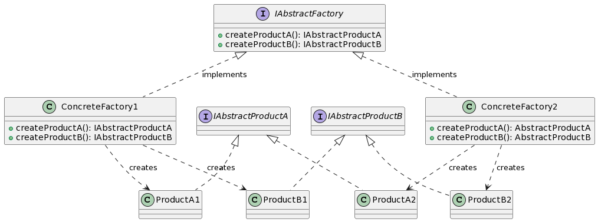

# Abstract Factory Design Pattern

The Abstract Factory Design Pattern offers an interface for creating families of related or dependent objects without specifying their concrete classes. It provides a way to encapsulate a group of individual factories that have a common theme.

  

### Analogy:

Imagine a furniture store where you can choose between different styles, like 'Modern', 'Victorian', or 'Art Deco'. For each style, there's a suite of matching furniture: chairs, tables, sofas, etc. Abstract Factory provides a way for you to pick a style and then produce furniture that matches that style, without detailing the exact type or construction of each piece.

### Benefits:

1. **Consistency**: Ensures that products from one family are used together.
2. **Separation of Concerns**: Separates the product creation code from its use.
3. **Extensibility**: Easily add new product families without changing existing code.
4. **Isolation of Concrete Classes**: The application code only deals with abstract interfaces.
5. **Exchangeability**: Different product families can be easily swapped.
  
### Criticisms:

1. **Complexity Increase**: The pattern can complicate the system if overused.
2. **Static Nature**: Typically requires all products to be created upfront.
3. **Difficult to Support New Kinds of Products**: Requires extending the factory interface, which might affect existing clients.

### Common Scenarios for Abstract Factory:

- **User Interfaces**: Providing a consistent look and feel across platforms.
- **Toolkits & Libraries**: Ensuring integration consistency among a suite of products.
- **Cross-Platform Development**: Offering platform-specific implementations of components.
- **Configurations**: Serving different configurations with varied components.

### Conclusion:

The Abstract Factory pattern is powerful for ensuring thematic consistency in product families and isolating concrete product classes from client code. Like all design patterns, understanding its use-cases, benefits, and potential pitfalls is crucial to leverage it effectively in system design.
