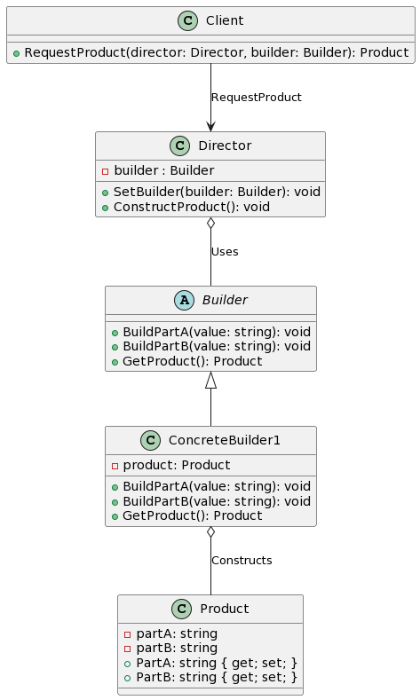

# Builder Design Pattern

The Builder Design Pattern is a creational pattern that provides a clear and flexible solution for constructing complex objects. Instead of using multiple constructors, the builder pattern uses another object, a builder, that receives each initialization parameter step by step and then returns the resulting constructed object.

  

### Analogy:

Think of the process of building a house. Instead of trying to build it in one go (which would be messy and prone to mistakes), you'd use a series of steps: first the foundation, then the walls, the roof, and so on. The builder pattern is like the architect who takes in one specification at a time and coordinates the construction process until the house is complete.

### Benefits:

1. **Separation of Concerns**: Separates the construction of a complex object from its representation.
2. **Method Chaining**: Offers a readable and intuitive way to specify object construction.
3. **Immutable Objects**: Supports the construction of immutable objects since an object can be constructed in a complete state.
4. **Variability**: Different representations of an object can be constructed using the same construction process.
5. **Fine-grained Control**: Allows step-by-step object construction or even optional steps.
6. **Clear Parameter Setting**: Helps avoid long parameter lists and confusing multiple constructors.

### Criticisms:

1. **Overhead**: Introduces more classes and objects, increasing the complexity.
2. **Specific to Object Construction**: Only useful when there's a need for a complex object creation process.
3. **Confusion**: When misused, it might confuse other developers who are not familiar with the pattern.

### Common Scenarios for Builder:

- **Complex Object Creation**: When an object requires many steps to be created.
- **Immutable Objects**: Helps in constructing objects that shouldn't change after they're constructed.
- **Parameter Overload**: Avoids constructors with a large number of parameters.
- **Configurable Objects**: When an object needs various configurations before being instantiated.
- **Readability**: Provides a more readable way to set parameters as compared to multiple constructors.

### Conclusion:

The Builder pattern is excellent for situations where an object needs to be created with a variety of configurations. By encapsulating the construction logic inside a builder, you can ensure that the end object is constructed correctly regardless of the order or number of configurations provided. Like all design patterns, the key is to know when it's appropriate to use it and when a simpler solution might suffice.
