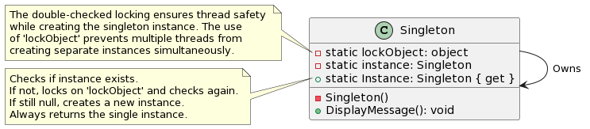

# Singleton Design Pattern

The Singleton Design Pattern is a design principle that ensures a specific class has only a single instance throughout your application and offers a way to access this instance from anywhere.

  

### Analogy:

Imagine a room with only one light bulb. No matter how many bulbs you try to install, there's only one that illuminates the room. Similarly, Singleton ensures only one instance of a specific class in your application.

### Benefits:

1. **Controlled Access to Single Instance**: Prevents multiple initializations, such as reading configurations multiple times.
2. **Lazy Initialization**: The object gets created only when needed, optimizing performance.
3. **Global Point of Access**: Easily accessible from different application parts without passing around.
4. **Shared State**: A unified point of truth accessible across the application.
5. **Reduced Overhead**: Avoids resource-intensive multiple instantiations.
6. **Protect Against Overwriting**: Prevents unintended side effects or state inconsistencies.

### Criticisms:

1. **Global State**: Can introduce hidden class dependencies.
2. **Testing Challenges**: Global state can persist between test runs.
3. **Potential Overuse**: Can make design less modular.
4. **Scalability Issues**: Synchronization can introduce overhead in multithreaded scenarios.

### Common Scenarios for Singleton:

- **Unique Component Control**: Ensures components initialize once and maintains state.
- **Shared Resources**: Prevents contention or redundant resource allocation.
- **Configuration Management**: Avoids repeated reading and parsing of settings.
- **Logging**: Coordinates logging activities for consistency.
- **Performance and Memory Efficiency**: Prevents resource-intensive re-instantiations.
- **Coordinating Actions**: Acts as a central control or communication point.
- **Extendability**: Can be paired with the Factory Method pattern for more flexibility.

### Conclusion:

While Singleton can be a solution to specific design challenges, it's crucial to recognize when to use it and when other patterns or solutions might be more fitting. Using Singletons judiciously and understanding their trade-offs is key to leveraging their benefits effectively.
